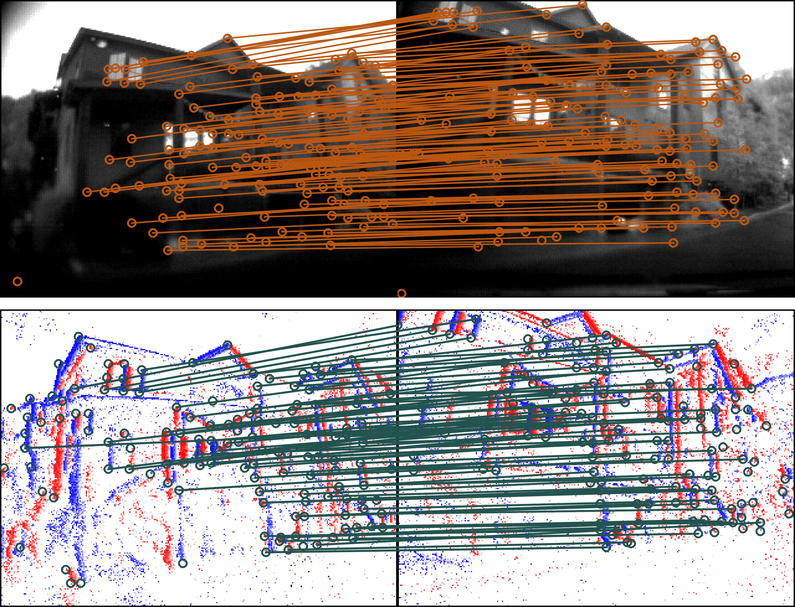

<h2 align="center">
  <b>SuperEvent: Cross-Modal Learning of Event-based Keypoint Detection for SLAM</b>
  <br>
  <small>ICCV 2025 (Highlight)</small>
  <br>
  <small>🏆 Winner: IROS 2025 EvSLAM Challenge</small>
  <br>

<div align="center">
    <a href="https://arxiv.org/abs/2504.00139" target="_blank">
    </a>
    <a href="https://openaccess.thecvf.com/content/ICCV2025/html/Burkhardt_SuperEvent_Cross-Modal_Learning_of_Event-based_Keypoint_Detection_for_SLAM_ICCV_2025_paper.html" target="_blank">
    </a>
    <a href="https://ethz-mrl.github.io/SuperEvent/" target="_blank">
    </a>
    <a href="https://youtu.be/YWBr8oChfDE" target="_blank">
    </a>
</div>
</h2>

<div align="center">
    
</div>

This is the official repository of [**SuperEvent: Cross-Modal Learning of Event-based Keypoint Detection for SLAM**](https://arxiv.org/abs/2504.00139).  
For more details, please check our [**project page**](https://ethz-mrl.github.io/SuperEvent/).

## Installation

Clone this repository
```bash
git@github.com:ethz-mrl/SuperEvent.git
cd SuperEvent
# If you want to generate training data, you need to initialize the submodules (SuperGlue)
git submodule update --init --recursive
```

Create conda environment
```bash
conda create --name se python=3.12
conda activate se
```

Install requirements with pip
```bash
pip install -r requirements.txt
```

Add SuperEvent root directory to Pythonpath (required in every new terminal)
```bash
export PYTHONPATH=$PYTHONPATH:$PWD
```

## Steps to prepare training data

1. Filter images without event stream at their timestamp.
2. Create Multi-Channel Time Surfaces (MCTS) at image timestamps.
3. Create pseudo labels using SuperPoint + SuperGlue.
4. Divide sequences into 'train', 'val' and 'test' sets.

Bash script to execute this pipeline:
```bash
./data_preparation/prepare_training_data.sh -d path/to/dataset
```

Optional arguments:  
`-t` : Path where SuperEvent training data will be written. Default: `path/to/dataset/../SuperEvent_data`  
`-c` : Path of config file containing the desired 'train', 'val' and 'test' splits. Default: `${HOME}/repos/SuperEvent/config/super_event.yaml`  
`-u` : Adding this flag will create undistorted training data. We do not recommend turning undistortion on, since it can lead to artifacts in the MCTS.  

We combined the following five datasets for training:
- [MVSEC](https://daniilidis-group.github.io/mvsec/)
- [ViVID++](https://visibilitydataset.github.io/)
- [DDD20](https://sites.google.com/view/davis-driving-dataset-2020)
- [FPV](https://fpv.ifi.uzh.ch/)
- [GRIFFIN](https://grvc.us.es/eye-bird-dataset/)

## Training
```bash
python train.py
```

## Evaluation
```bash
python evaluate_pose_estimation.py <path/to/evaluation/dataset>
```

We support evaluation on the following datasets:
- [Event-Camera Dataset](https://rpg.ifi.uzh.ch/davis_data.html)
- [Event-aided Direct Sparse Odometry](https://rpg.ifi.uzh.ch/eds.html)

## Qualitative examples
```bash
python visualize_matches.py
```

Shows matched keypoints from SuperEvent inference on test set with SuperPoint + SuperGlue's pseudo labels.

## Citation
If you find our work useful, please cite:
```bibtex
@InProceedings{Burkhardt_2025_ICCV,
    author    = {Burkhardt, Yannick and Schaefer, Simon and Leutenegger, Stefan},
    title     = {SuperEvent: Cross-Modal Learning of Event-based Keypoint Detection for SLAM},
    booktitle = {Proceedings of the IEEE/CVF International Conference on Computer Vision (ICCV)},
    month     = {October},
    year      = {2025},
    pages     = {8918-8928}
}
```