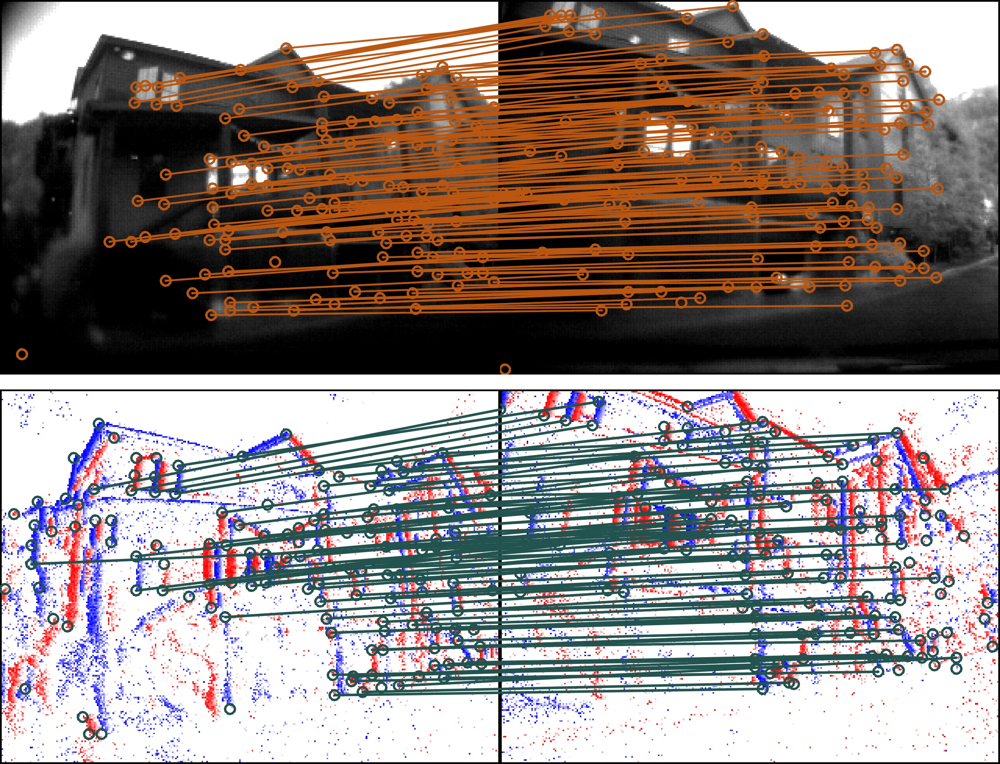

<h2 align="center">
  <b>SuperEvent: Cross-Modal Learning of Event-based Keypoint Detection for SLAM</b>
  <br>
  <small>ICCV 2025 (Highlight)</small>
  <br>
  <small>🏆 Winner: IROS 2025 EvSLAM Challenge</small>
  <br>

<div align="center">
    <a href="https://arxiv.org/abs/2504.00139" target="_blank">
    </a>
    <a href="https://openaccess.thecvf.com/content/ICCV2025/html/Burkhardt_SuperEvent_Cross-Modal_Learning_of_Event-based_Keypoint_Detection_for_SLAM_ICCV_2025_paper.html" target="_blank">
    </a>
    <a href="https://ethz-mrl.github.io/SuperEvent/" target="_blank">
    </a>
    <a href="https://youtu.be/YWBr8oChfDE" target="_blank">
    </a>
</div>
</h2>

<h2 align="center">
  <b>AERO-VIS: Asynchronous Event-based Real-time Onboard Visual-Inertial SLAM</b>
  <br>
  <b><i>RA-L 2026</i></b>

<div align="center">
    <a href="https://arxiv.org/abs/2605.07885" target="_blank">
    </a>
    <a href="https://ethz-mrl.github.io/AERO-VIS/" target="_blank">
    </a>
    <a href="https://youtu.be/gM7SNVuPbXg" target="_blank">
    </a>
</div>
</h2>

<div align="center">
    
</div>

This is the official repository of [**SuperEvent: Cross-Modal Learning of Event-based Keypoint Detection for SLAM**](https://arxiv.org/abs/2504.00139). For more details, please check our [**project page**](https://ethz-mrl.github.io/SuperEvent/).  

🔔 **Update August 25, 2026** 🔔  
We have added the improved models **SuperEvent+**, **SuperLitE** used in our paper [**AERO-VIS: Asynchronous Event-based Real-time Onboard Visual-Inertial SLAM**](https://ethz-mrl.github.io/AERO-VIS/) and the related training, evaluation, and export code.

## Installation

Clone this repository
```bash
git@github.com:ethz-mrl/SuperEvent.git
cd SuperEvent
# If you want to generate training data, you need to initialize the submodules (SuperGlue)
git submodule update --init --recursive
```

Create conda environment
```bash
conda create --name se python=3.12
conda activate se
```

Install requirements with pip
```bash
pip install -r requirements.txt
```

Add SuperEvent root directory to Pythonpath (required in every new terminal)
```bash
export PYTHONPATH=$PYTHONPATH:$PWD
```

## Demo

To test the system using the pre-generated files in `example_data` (MCTS + pseudo labels), run
```bash
python visualize_matches.py --config <super_event / super_event_plus / super_lite>.yaml
```

## Steps to prepare training data

1. Filter images without event stream at their timestamp.
2. Create Multi-Channel Time Surfaces (MCTS) at image timestamps. By default, the MCTS will have constant event count, since SuperEvent+ and SuperLitE achieve higher accuracy with this event representation. MCTS with constant time windows (SuperEvent) can be generated by passing the `-w` flag.
3. Create pseudo labels using SuperPoint + SuperGlue.
4. Divide sequences into 'train', 'val' and 'test' sets.

Bash script to execute this pipeline:
```bash
./data_preparation/prepare_training_data.sh -d path/to/dataset
```

Optional arguments:  
`-t` : Path where SuperEvent training data will be written. Default: `path/to/dataset/../SuperEvent_data`  
`-c` : Path of config file containing the desired 'train', 'val' and 'test' splits. Default: `${HOME}/repos/SuperEvent/config/super_event.yaml`  
`-w` : Build the legacy MCTSs with constant time windows. 

We combined the following five datasets for training:
- [MVSEC](https://daniilidis-group.github.io/mvsec/)
- [ViVID++](https://visibilitydataset.github.io/)
- [DDD20](https://sites.google.com/view/davis-driving-dataset-2020)
- [FPV](https://fpv.ifi.uzh.ch/)
- [GRIFFIN](https://grvc.us.es/eye-bird-dataset/)

## Training
```bash
python train.py
```

## Evaluation
```bash
python evaluate_pose_estimation.py <path/to/evaluation/dataset>
```

We support evaluation on the following datasets:
- [Event-Camera Dataset](https://rpg.ifi.uzh.ch/davis_data.html)
- [Event-aided Direct Sparse Odometry](https://rpg.ifi.uzh.ch/eds.html)

## Qualitative examples
```bash
python visualize_matches.py
```

Shows matched keypoints from SuperEvent inference on test set with SuperPoint + SuperGlue's pseudo labels.

## Export downstream C++ usage (e.g., with TensorRT)
We also provide the [superevent-runtime](https://github.com/ethz-mrl/superevent-runtime) library with pregenerated models as well as optimized inference code, a time-surface generator, and usage examples. [superevent-runtime](https://github.com/ethz-mrl/superevent-runtime) is also integrated in [OKVIS2-X](https://github.com/ethz-mrl/OKVIS2-X) to enable event-based SLAM.  
To export a model yourself (e.g., with different spatial resolution or batch size), there are two options to export the model.

### 1. TorchScript
TorchScript is portable, but not very performance-optimized.
```bash
python export/export_model.py saved_models/super_event_plus_weights.pth --config config/super_event_plus.yaml --dynamic_shapes
```

### 2. ONNX -> TensorRT
To export the model to ONNX, please install the follwing additional dependencies:
```bash
pip install onnx onnxruntime onnxscript
```

To export a model with fixed shape and batch size in fp16 precision to onnx, the following flags can be used:
```bash
python export/export_model.py saved_models/super_lite_weights.pth --config config/super_lite.yaml --out_dir onnx_models/super_lite_weights --dtype float16 --input_shape "240 320" --batch_size 2 --use_onnx
```

Alternatively, there is a bash script to create models with batch size 2 and fp16 for the common event camera resolutions:
```bash
python export/export_model.py saved_models/super_event_plus_weights.pth --config config/super_event_plus.yaml --dynamic_shapes
```

Instructions on how to convert the ONNX model to TensorRT can be found in [superevent-runtime/model_zoo/trt/](https://github.com/ethz-mrl/superevent-runtime/tree/main/model_zoo/trt).

## Citation
If you find our work useful, please cite one of the following works:
```bibtex
@InProceedings{Burkhardt_2025_ICCV,
    author    = {Burkhardt, Yannick and Schaefer, Simon and Leutenegger, Stefan},
    title     = {SuperEvent: Cross-Modal Learning of Event-based Keypoint Detection for SLAM},
    booktitle = {Proceedings of the IEEE/CVF International Conference on Computer Vision (ICCV)},
    month     = {October},
    year      = {2025},
    pages     = {8918-8928}
}
```
```bibtex
@article{Burkhardt_2026_RAL,
    title={{AERO-VIS}: Asynchronous Event-based Real-time Onboard Visual-Inertial {SLAM}},
    author={Burkhardt, Yannick and Barbas Laina, Sebasti\'an and Boche, Simon and Frei{\ss}muth, Leonard and Leutenegger, Stefan},
    journal={IEEE Robotics and Automation Letters},
    year={2026}
}
```